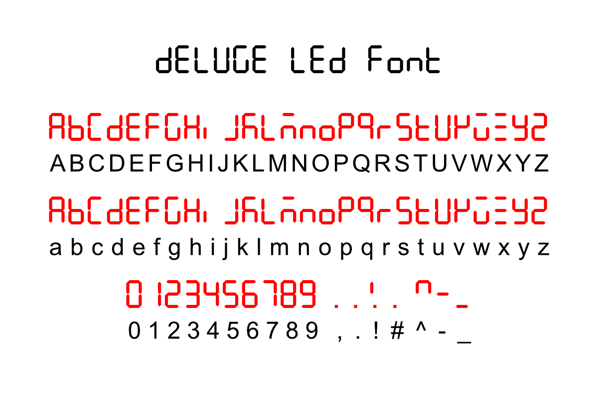

# Deluge LED Font

### A True Type font of the Deluge special-character alphabet.

The Synthstrom Deluge has a 4-digit LED display. It uses a special alphanumeric character set that can be displayed on the 7-segment display.

This True Type font allows you to use those special characters in Deluge cheatsheets, tutorials, overlays, manuals, videos, etc.

The uppercase and lowercase characters are the same. The punctuation set is limited to comma, period, exclamation mark, hash, carat, dash and underscore.

**Note:** the comma and the period both display the dot after the digit. The hash displays the dot after the *previous* digit.

## Installation

1. [Download this repository as a zip file](https://github.com/weavermedia/deluge-led-font/archive/refs/heads/main.zip)
2. Unzip the contents
3. macOS: Double-click `deluge-led.ttf` to open Font Book then click Install.
4. Win10: Right-click `deluge-led.ttf` and choose "Install for all users".

## License

This font was created using Fontstruct the free, online font-building tool. It is is licensed under a Creative Commons CC0 Public Domain Dedication license (http://creativecommons.org/publicdomain/zero/1.0/). Full license [here](license.txt).
